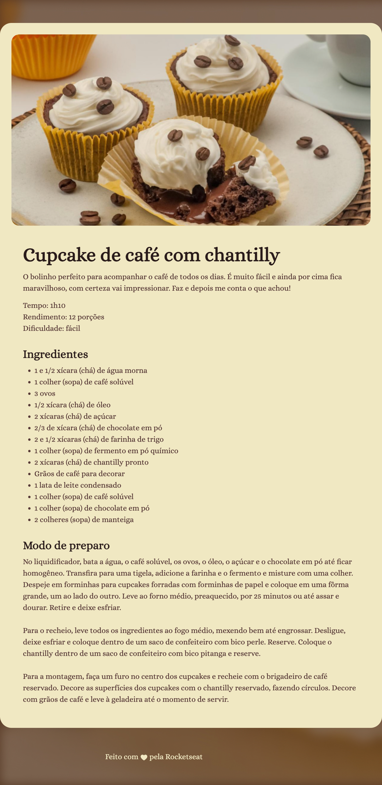

# Página de Receita

>Full-Stack - Projeto: Página de Receita

Primeiro Projeto do curso de Full-Stack da Rocketseat.

## 👨‍💻 Tecnologia

- HTML
- CSS
- Git e Github

# 💭 O que aprendi?

Neste projeto reiniciei a jornada de Dev e comecei pelos conceitos básicos de Front-end para relembrar e aperfeiçoar, neste caso foram usados os conceitos mais básicos para construir a página, aprendemos a adicionar imagens, tanto de fundo quanto na parte principal, como nao deixar a imagem de background ficar se repetiindo infinitamente e como modelar de forma simples toda a página para ter um aspecto agradável.

## 📚 Contato

- e-mail: lucas.primati@hotmail.com
- github: [🔗 github](https://github.com/luprime)
- Linkdedl: [🔗 Linkedln](https://www.linkedin.com/in/lucas-primati/)